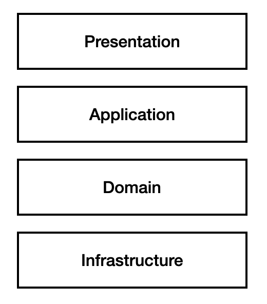
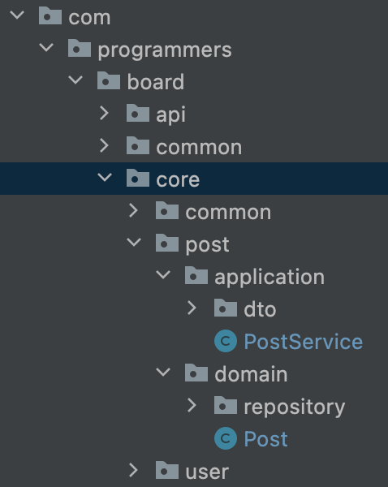
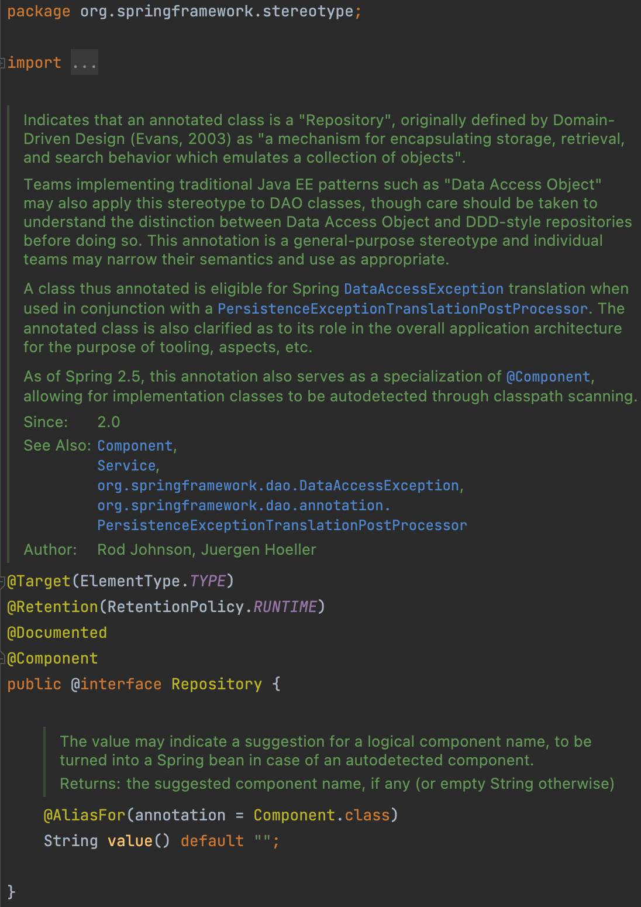
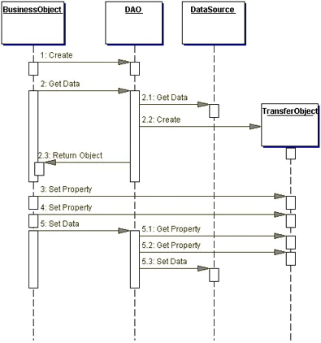

## 알아보게된 계기

- 예전에 정리해놔야지 하고 게으름에 미뤄놨던 개념 확립하기.
  - 설명 못해서 창피했네...
- 아 repository, dao, infrastructure 다른 건 알겠는데 어떻게 달랐더라...
- 패키지 사람들마다 다르게 써서 이거 어떻게 하지...

 

## Spring과 DDD 관점 계층

 

- Spring

 

|           일반적인 구조            |
| :--------------------------------: |
|  |

 

> 스프링으로 웹 개발 코드를 작성해보신 분들이라면 대부분 저 구조를 이해하실 것같다.  
> 아마 처음 하실땐 다들 그렇게 하니깐 계층 생각하지 않고,  
> controller, servcie, repository 패키지 만들고 클래스 작성하고,  
> dao 개념 나오는데 그거 뭐 말 그대로 데이터 액세스 하는거니깐 repository가 dao인가보다 그랬다.  
> `실제로 처음 스프링부트 사용하고 나서부터 제법 오랫동안 repository가 dao인 줄 알았다.`

 

- 웹 아키텍처

| 일반적인 웹애플리케이션 아키텍처 |
| :------------------------------: |
|   |

 

|       spring       |     ddd      |
| :----------------: | :----------: |
|     Controller     | Presentation |
|      Service       | Application  |
| Entity, Repository |    Domain    |

 

> 그리고 계층에 대한 의문점이 생기기 시작하면서 DDD를 찍먹이라도 해봤는데, 이때 우선 위와 같이 받아들였고, 실제로 계층을 이해하고 프로젝트를 진행한 친구의 패키지 전략을 레퍼해서 프로젝트를 진행했다

 

|         실제 내 프로젝트 패키지 예시         |
| :------------------------------------------: |
|  |

 

- `api`에서 controller를 통해 api를 받고
- `core`에 있는
  - `application` 패키지에서 service 처리
  - `domain` 패키지에서 Entity class들을 갖고, Repository를 작성했다.

 

- @Repository 어노테이션

 

> 위에 얘기하면서 빠진 내용이 infrastructure와 dao다.  
> 그래서 두 개는 대체 우리가 개발하는 코드 영역에서 어디인지가 너무 궁금했다.
> 그런데 왜 @Repository 어노테이션을 부제로 정했냐면

 

|      org.springframework.stereotype      |
| :--------------------------------------: |
|  |

 

> (다소의역이 있을 수 있음)  
> @Repository는 DDD에 의해 정의된 것이고, 객체 모임(저장과 검색과 같은 행위)을 캡슐화해놓은 것이다.  
> 즉 전통적인 `DAO` JAVA EE 패턴들은 이걸 @Repository로 적용할 수 있지만, DAO와 DDD-style repository를 구별해서 이해해야한다.
> (이하 생략...)

 

 

- 그러면 DAO는?

> J2EE에서 등장한 개념으로 애플리케이션을 사용하다보면 저장소 매커니즘이 필요해지는 경우가 많다. 영구 저장소의 구현체는 무수하게 많다. (그 중 우리가 많이 쓰는 MySQL, Oracle...)
> 그렇다고 벤더사들의 API를 사용한 모든 구현을 변경이 일어날때마다 바꾸는 것은 너무 힘들 것이다. `(강한 결합...)`  
> 또한 DAO 없이 `응용 계층(Service)` 에서 sevice로직을 담당하는 객체들과 db와 관련된 api가 강한 결합을 갖게 되고, 영속성과 관련된 로직이 서비스 로직에 생성 될 것이다. `(계층 파괴)`

 

|                                     Figure 9.2 Data Access Object sequence diagram                                     |
| :--------------------------------------------------------------------------------------------------------------------: |
|                                                                               |
| [참고: Oracle Core J2EE Patterns - Data Access Object](https://www.oracle.com/java/technologies/dataaccessobject.html) |

 

- BuisnessObject
  - 저장소 데이터를 얻기위해 data source에 접근을 요청하는 객체
  - BuisnessObject는 session bean, entity bean 혹은 다른 Java 객체에 의해 실행 된다.
- DataAccessObject
  - DataAccessObject는 BuisnessObject가 DataSource에 보다 더 명확한 접근을 하기위해 data access 구현을 추상화 한 것
  - `Buisness Object는 data load와 store operation들을 DataAccessObject에 위임한다.`
- Transfer Object
  - data transfer 용도

 

> 그러니까 코드를 짜는 개발자가 datasource에 접근하고 저장소에 필요한 연산을 처리하는 것을 직접하는 것이 아니라 dao를 거쳐서 즉, dao에게 위임하여 사용하는 것이 dao 패턴이다.
> DAO는 데이터베이스 테이블과 일치하게 된다.

 

## Repsitory vs DAO

 

- Repository는 객체 Collection의 추상화
- DAO는 Data Persistence의 추상화

 

- DAO는 storage 시스템에 더 가까운 개념이고 상대적으로 low level 개념
- Repository는 Domain객체에 가까운 개념으로 상대적으로 high level concept
- 그러니까 우리는 JPA를 사용하여 Entity를 정의하고 Repository를 작성하면 DB 연산을 실행할 수 있었기 때문에 `직접 구현체를 작성할 일이 없어서 헷갈렸다...`

 

- 그러면 infrasturuce는 뭐야...

 

> 외부 저장소 시스템을 호출해서 서비스를 이용하는 것  
> 실제 찾아봤을때 와닿지 않는 말 뿐들이어서, `주위 조언들을 구해봤을때 외부 db에서 정보를 찾아오는 api를 호출할때의 저장소를 사용하는 용도의 계층으로 많이 정의를 내리고 사용한다고 한다.`  
> 실제 커리어넷 api를 쓰던 어떻게 하던?

 

## 조언과 자료를 찾아본 결론

 

- `repository를 dao라 하는 것은 완전히 틀린말도 아니지만 맞는 말도 아니다.` 관점의 차이인듯. 하지만 현재 사용하고 있는 프레임워크가 spring이고 그것이 `@Repository가 생겨난 배경이 DDD`에 근거한다면 그정도 이름을 지켜주자. -> 사실 난 dao가 와닿지 않아...
  - JDBC를 사용할때는 dao가 더 어울리지 않을까.
  - dao는 너무 legacy같은 용어라는 지적.
- `infrastructure는` 일단은 외부 저장소 시스템을 사용하기 위한 계층이라고 이해하고 그런 용도로 쓰자.

 

### 진짜 마지막 결론

 

- ddd를 알긴 알아야 하되 너무 집착하지말자.
- 그렇다고 근거 없이 쓰기에는 자존심 상해.

 
