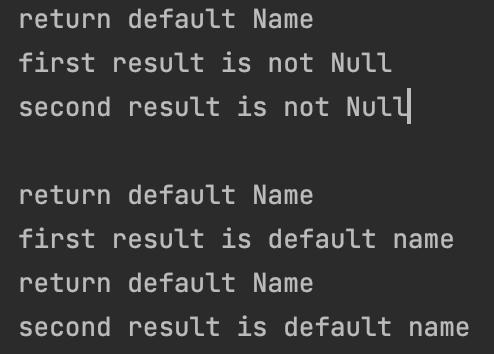

</br>

```java
    /**
     * If a value is present, returns the value, otherwise returns
     * {@code other}.
     *
     * @param other the value to be returned, if no value is present.
     *        May be {@code null}.
     * @return the value, if present, otherwise {@code other}
     */
    public T orElse(T other) {
        return value != null ? value : other;
    }

    /**
     * If a value is present, returns the value, otherwise returns the result
     * produced by the supplying function.
     *
     * @param supplier the supplying function that produces a value to be returned
     * @return the value, if present, otherwise the result produced by the
     *         supplying function
     * @throws NullPointerException if no value is present and the supplying
     *         function is {@code null}
     */
    public T orElseGet(Supplier<? extends T> supplier) {
        return value != null ? value : supplier.get();
    }

```

</br>

> 두 메서드의 javadoc을 읽어보면  
> null이 아니면 값을 return하고 그렇지 않으면 Other를 반환한다고 되어있다.  
> orElseGet은 suplier 메서드로부터 생성된 결과를 리턴해준다고 한다.
> 그러니까 즉, `두 메서드는 null의 여부와 상관없이 실행된다는 것이다.`

</br>

```java
package study;

import java.util.Optional;

public class OptionalCheck {

    public void javaOptionalCheck(String checkName){
        String result = Optional.ofNullable(checkName).orElse(defaultName());
        System.out.println("first result is " + result);

        result =  Optional.ofNullable(checkName).orElseGet(this::defaultName);
        System.out.println("second result is " + result);
    }

    public String defaultName(){
        System.out.println("return default Name");
        return "default name";
    }
}

```

```java

package study;

public class AnotherMain {

    public static void main(String[] args) {

        OptionalCheck optionalCheck = new OptionalCheck();

        optionalCheck.javaOptionalCheck("not Null");

        System.out.println();

        optionalCheck.javaOptionalCheck(null);

    }

}

```

</br>

|               결과               |
| :------------------------------: |
|  |

</br>

> null이 아닐 경우는 OrElseGet()에서는  
> defaultName이 실행되지 않는 것처럼 보인다.

</br>

- OrElse에서 defaultName이 null이 아닌데도 불구하고 defaultName()이 실행 된 이유?

</br>

> OrElse 메서드 파라미터에 값을 넘긴 것이 아니라  
> `값을 return 해주는 메서드를 넘겼기 때문이다`

</br>

- 즉 파라미터를 메서드로 넘겨주면

```java
public T orElse(defaultName()){
  return value != null ? value : defaultName();
}
```

> 이렇게 실행이 될 텐데,
> 이때 값을 지정하기 위해 출력문이 출력되고 나서,  
> `defaultName()이 리턴해주는 값으로 바뀐다`.  
> `값을 정해주기 위해 미리 실행되어야 한다!`

</br>

- 그러면 OrElseGet은 왜 null이 아닐때 defaultName()이 실행되지 않았을까?

```java
/**
 * Represents a supplier of results.
 *
 * <p>There is no requirement that a new or distinct result be returned each
 * time the supplier is invoked.
 *
 * <p>This is a <a href="package-summary.html">functional interface</a>
 * whose functional method is {@link #get()}.
 *
 * @param <T> the type of results supplied by this supplier
 *
 * @since 1.8
 */
@FunctionalInterface
public interface Supplier<T> {

    /**
     * Gets a result.
     *
     * @return a result
     */
    T get();
}
```

```java
    public T orElseGet(Supplier<? extends T> supplier) {
        return value != null ? value : supplier.get();
    }
```

</br>

> 우리는 supplier로 defaultName을 넘겨주고  
> OrElse와 다르게 return하는 값을 결정하는 것은  
> value가 `null인지 아닌지 판단하는 시점에 실행이 되는 것이다.`

- 그러니까 OrElse는 일단 리턴 값을 결정해주고 null인지 판단한 후 최종 return을 해주는 것이고
- OrElse Get은 null 여부를 판단 한 후에 null이면 Supplier.get을 실행시켜 값을 결정해준 후에 return 해주는 것

</br>

## 결론은 똑같지 않다!

</br>

- `아 그냥 값 똑같이 리턴해주네`?

> Spring으로 웹개발을 하시는 분들이라면  
> JPA로 null인 Entity를 가져오고 그것을 처리하는 작업들을 많이 하셨을 것같다.  
> 그렇다면 Entity가 null일 경우 대체되는 것을 return한다고 했을때,  
> 이것이 `null일 경우에는 문제가 없을 것이다. -> 두 함수 다 실행 되니깐`
>
> 그런데 OrElse의 경우 `null 여부와 상관없이 파라미터 메서드를 먼저 실행 한다는 것이다.`  
> 리턴값이야 같겠지만 `의도하지 않은 메서드가 실행된다.`

</br>

> 사실 SpringData JPA를 쓰면서 저런 오류가 얼마나 나올까 싶긴하지만,  
> 비즈니스 로직이 복잡해지다보면, 의도하지 않은 실수가 발생될 수 있다.  
> 또한 Spring에서 JPA를 쓸 경우 transaction 기능을 지원받기 때문에  
> 더군다나 Service Class를 작성할때 유의해야한다.

- 조금 억지스럽지만
  - 이때 application layer에서 실수 할 경우, 의도하지 않은 데이터를 DB에 넣을 수도 있다.
  - `애시당초 위험한 가능성을 배제하자.`

</br>
