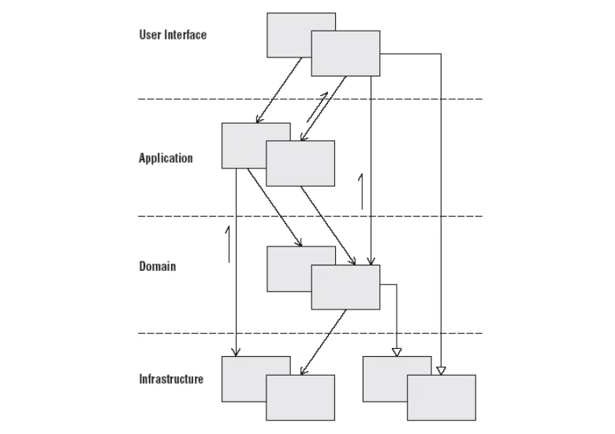

> 개발자들은 유지보수 용이성을 갖춘 소프트웨어를 통해  
> 기존의 코드를 최대한 건드리지 않고 모듈의 동작을 확장시킬 수 있어야한다.
>
> 소프트웨어가 이러한 유연성을 갖추기 위해서는 다양한 측면에서의 고민이 필요한데,  
> 해당 글을 참고하여 Code Base Architecture를  
> 견고하게 설계하는 방법에 대해 정리해보려고 한다!

 

- Code base Architecture 목적

 

> 어플리케이션의 핵심이 되는 비즈니스 로직을  
> 여러가지 기술적인 의존성으로부터 격리시킴으로써  
> 확장과 유지보수를 돕는 역할을 하기 때문에  
> 유연성 있는 소프트웨어가 갖추어야  
> 할 필수적인 요소 중 하나라고 말할 수 있다.

 

## 서론

> 실제 프로젝트가 작은 편이긴 했지만 규모대비  
> 실제 기능 및 코드를 많이 작성했었다.  
> 우리팀은 controller, service, domain  
> 흔히 스프링 쓰는 주니어들처럼 패키지를 두고 진행했는데  
> 과연 우리가 계층을 존중해서 짰을까...?(의존성 불러오는 문제부터...)  
> 이미 계층이 서로 오염된 것같은데 이 문제를 개선하고 싶어  
> 친구 회사 분 글을 참고하게 되었다.
>
> Layerd Architecture와 gradle이 무엇인지 알아보고  
> gradle의 어떤 기능때문에 layered architecture를 구현하는데  
> gradle을 적극적으로 활용하게 되었는지 정리해보겠다!

 

### Layered Architecture?

 

|             Layered architecture란?              |
| :----------------------------------------------: |
|  |

 

> Layerd Architecture란 말 그대로 계층이 나뉘어져 있는 아키텍쳐를 의미한다.  
> layerd architecture의 주된 목표는 어플리케이션을  
> 여러개의 굵직한 횡단 관심사(cross-cutting concern)로 분리하여,  
> 각각의 `layer는 하나의 관심사에만 집중할 수 있도록 하는 것이다.`  
> 각각의 layer에 대한 명칭은 조금씩 다르지만 근본적인 역할과 목표는 비슷하며,  
> 대표적으로 DDD에서 위와 같이 계층을 소개한다.

 

> layered architecture의 궁극적인 목표는  
> `application layer와 domain layer가 기술에 대해 가지는 의존성을 최소화 하여`  
> 오직 순수한 비즈니스 로직을 작성하는 데에 집중할 수 있게 하는 것이다.  
> applicaiotn layer와 domain layer에 기술 의존성이 깊숙히 침투한다면  
> 어플리케이션의 핵심 비즈니스 로직이 기술의 변경(라이브러리 종류 혹은 버전 변경 등)에  
> 강하게 결합될 것이고, 이는 어플리케이션의 기능확장과 유지보수 관점에서 엄청난 cost를 야기할 것이다.

 

### Gradle이란?

 

> gradle은 성능과 유연함에 초점으 둔 오픈소스 빌드 툴이다.  
> 우리가 여기서 집중해야할 gradle의 기능은 바로 `멀티 프로젝트` 기능이다.

 

> 멀티 프로젝트 기능은 `하나의 gradle project 하위에 여러 개의 gradle subproject를 생성할 수 있는 기능`으로  
> 그렇게 생성된 subproject는 각각 독립적으로 외부 의존성을 관리할 수 있다는 특징을 갖는다.  
> `불필요한 의존성을 최소화 하고, 도메인 지식이 존재하는 장소에 기술에 대한 의존성을 제거`한다는  
> layerd architecture의 핵심 아이디어에 잘 적용시킬 수 있을 기능이다.

 

## 본론

 

 

### Layer 살펴 보기

 

#### Presentation Layer

 

> 애플리케이션 중 가장 프론트 엔드와 가깝게 위치한 계층이다.

 

- client로부터 request를 받고 response를 return 하는 api 정의
- api route별 로깅, 보안등의 전처리

 

> presentation layer는 request와 response를  
> serving하는 protocol을 무엇으로 하냐에 영향을 받는다.  
> grpc프로토콜을 사용하게 될 경우 presentation layer는  
> grpc 관련 외부 라이버르러와 protobuf 파일에 대한 의존성을 다수 받게 된다.

 

#### Application Layer

 

> `application layer에 존재하는 함수들의 집합이 곧 애플리케이션의 요구사항이다.`
>
> application layer에는 고수준으로 추상화된 "어플리케이션 기능"이 담겨 있다.  
> 이 layer는 실제 비즈니스 로직을 담고 있지 않고,  
> domain layer에 존재하는 비즈니스 로직과 data access login을 orchestrate하여  
> 새로운 추상화를 창출하는 공간이라고 정의한다.
>
> 이 layer에는 service 객체들이 담기게 될 것인데,  
> service란 특정한 행위를 추상화하는 객체를 말한다.  
> `어플리케이션의 기능`이라 함은 곧 어떠한 행위를 뜻하기 때문에  
> application layer는 자연스럽게 service 객체를 담게 되는 것이다.

 

> 사실 ddd 관점에서 domain layer에서 service 객체가 존재할 수 있는데,  
> 다음과 같은 기준으로 applicaion layer와 domain layer 사이의 경계를 명확히 나누었다.

- application service란 어플리케이션 요구사항에 대하여 비즈니스 로직을 작성하지 않으면서 domain layer에 작성되어 있는 비즈니스 로직을 호출하기만 하면 된다.

 

#### Domain Layer

 

> domain layer는 핵심 비즈니스 로직이 담기는 곳으로, 어플리케이션의 가치를 결정하는 가장 중요한 layer이다.  
> 이 layer는 어떤 외부 관심사에 의존하지 않고 순수한 비즈니스 로직만을 담아야한다.  
> 여기에 담기는 비즈니스 로직은 낮은 추상화를 갖고 있음으로 어플리케이션 기능단위로 직접 활용될 여지가 크지는 않다.  
> 하지만 모든 어플리케이션 기능을 구현하는 데에 기반 재료로 활용 될 atomic한 로직들이 모두 이곳에 존재하기 때문에  
> 개발자들은 기능을 개발할 때 이 layer에 가장 신경을 많이 써야 한다.

 

#### Infrastructure Layer

 

> Infrastructure layer는 위에서 설명한 3개의 layer가 자신이 맡은 역할을  
> 온전히 수행할 수 있도록 기술적인 부분에서 지원해주는 layer이다.  
> infrastructure가 맡아야 하는 기능은

- 1. 프레임워크를 통한 어플리케이션 구동

> 위 3개의 layer들을 통합해서 하나의 어플리케이션으로 serving하는 역할을 해줄 무언가가 따로 필요하다.

- @SpringBootApplicaiton 어노테이션이 달린 App 클래스
- App 클래스를 실행하는 main 함수
- application.yml 등으로 정의된 application properties
- 적절한 spring bean을 띄우기 위한 configuration 클래스들

 

- 2. 기술 종속성이 강한 구현체 제공

 

> 앞서 설명했듯 domain layer에는 외부 의존성을 최소화 해야 하므로,  
> 순수하게 로직을 구현할 수 없는 경우 domain layer에는 인터페이스를 두고  
> 구현체를 infrastructrue layer로 분리하는 방법을 선택

 

> 이런 경우 Repository를 예시로 들 수 있는데,  
> repository에서 어떤 DBMS를 사용하는지, 어떤 ORM을 사용하는지 등  
> DB에 대한 정보를 알고 있다.  
> 하지만 DB에 관한 세부 사항은 명백히 도메인 지식과는 관계가 없음으로  
> domain layer에는 interface만 작성하고 이에대한 구현체는  
> infrastructure layer에서 작성하도록 하였다.

 

> 여기서 구현체는 DBMS로 mysql을 사용할 수도 있고, postgresql을 사용할 수도 있다.  
> 또한 ORM으로는 jpa를 사용할 수도 있고, myBatis를 사용할 수도 있습니다.  
> 이렇듯 기술에 대한 세부사항은 언제든 변경될 수 있는 것이기 때문에 인터페이스와 구현체를  
> 서로 다른 layer에 격리시키는 것이 큰 의미를 얻을 수 있다.

 

|               infrastructure -> domain               |
| :--------------------------------------------------: |
| [의존성의 방향이 역전](../res/_04_infrastructre.png) |

 

> 글에서는 2가지 역할 다 도메인 지식과 상관 없는 내용으로  
> infrastructure의 역할은 분명하지만,  
> 서로 다른 결의 역할을 하고 있기 때문에  
> infrastructure 내에서도 한 번 더 subproject로 분리한다.

- infrastructrue
  - boot : 어플리케이션을 구동한다는 의미에서
  - provider : 기술 구현체들을 제공해준다는 의미에서

 

#### Layer를 gradle subproject로 만들기
