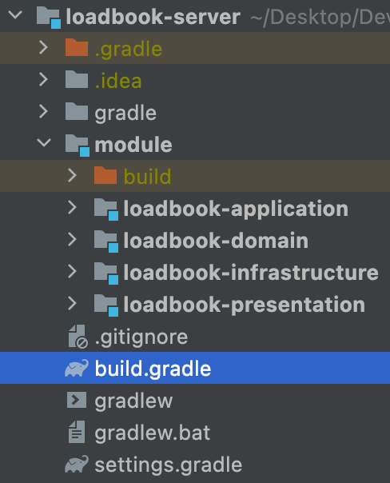
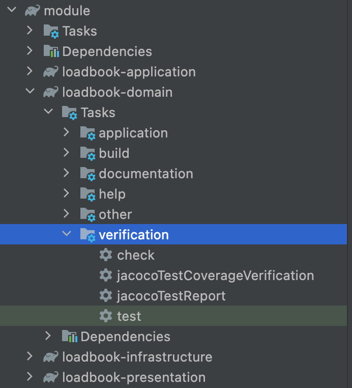
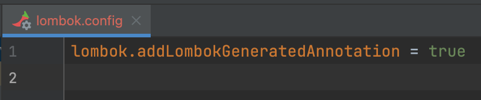
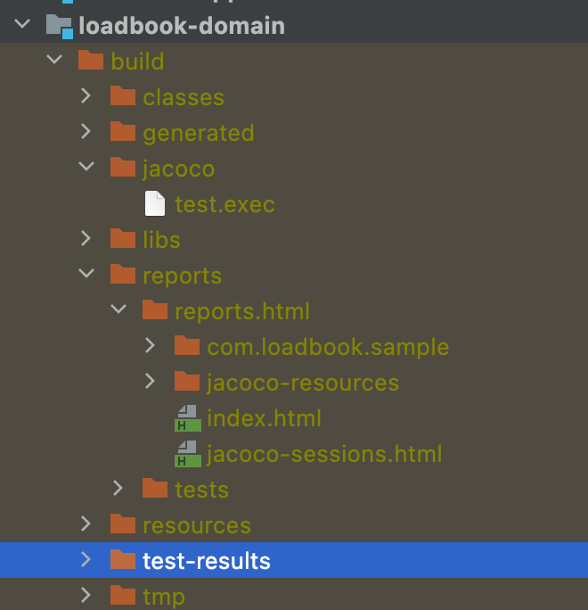
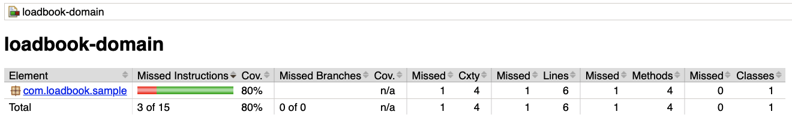

</br>

> 프로젝트를 시작하기에 앞서 팀에서 Jacoco를 도입하기로 결정하였습니다.  
> Jacoco가 어떤 것인지 알고는 있었으나, 도입한 적은 없었고,  
> `코드 커버리지 분석도구`라고 알고 있긴 한데  
> 설정하다보니 중요한 개념들을 모르고 있는 것같아서 정리하고자 합니다.  
> 우리팀원들에게 도움이 되기를...

</br>

- [테스트 코드의 장점](#테스트-코드의-장점)
- [코드 커버리지(Code Coverage)란?](#코드-커버리지code-coverage란)
- [코드 커버리지를 측정하는 기준?](#코드-커버리지를-측정하는-기준)
  - [구문(Line)](#구문line)
  - [조건](#조건)
  - [결정(branch)](#결정branch)
  - [그래서 어떤 걸 기준으로 커버리지를 측정해야하는데?](#그래서-어떤-걸-기준으로-커버리지를-측정해야하는데)
- [그렇다면 코드 커버리지는 중요한가?(사견 첨부)](#그렇다면-코드-커버리지는-중요한가사견-첨부)
- [자바 코드 커버리지](#자바-코드-커버리지)
- [Jacoco 적용하기](#jacoco-적용하기)
  - [개발 환경](#개발-환경)
  - [Jacoco 플러그인 설정](#jacoco-플러그인-설정)
  - [JacocoTestReports Task 설정하기](#jacocotestreports-task-설정하기)
  - [Jacoco 플러그인 Task 순서 설정 - finalizedBy 키워드 사용](#jacoco-플러그인-task-순서-설정---finalizedby-키워드-사용)
  - [커버리지에 제외할 클래스 설정하기](#커버리지에-제외할-클래스-설정하기)
  - [Lombok 제외](#lombok-제외)
  - [html 확인하기](#html-확인하기)

</br>

## 테스트 코드의 장점

</br>

- 애플리케이션의 `안정성`을 높여준다.
- 기능 추가 및 수정으로 인한 side-effect를 감소시킨다.

</br>

> 우선 제가 생각하는 테스트 코드의 장점은 이정도입니다.  
> 하지만 이러한 상황에서 우리 팀이 테스트 코드를 잘 작성했는지  
> 또한, 의미없는 테스트 코드를 짜고 있지는 않은지 확인해야할 필요가 있습니다!  
> 코드 커버리지는 이러한 관점에서 팀에서 추구해야할 테스트의 방향성과  
> 최소한의 안전장치?로서의 기능을 해줄 수 있을 것같습니다.

</br>

## 코드 커버리지(Code Coverage)란?

</br>

> 코드 커버리지는 소프트웨어의 `테스트케이스가 얼마나 충족되었는지를 나타내는 지표` 중 하나입니다.  
> 테스트를 진행하였을 때 `코드 자체가 얼마나 실행되었느냐`는 것이고, 이는 수치를 통해 확인할 수 있습니다.

</br>

## 코드 커버리지를 측정하는 기준?

</br>

> 코드 커버리지는 소스 코드를 기반으로 수행하는 `화이트 박스 테스트`를 통해 측정합니다.

- 블랙 박스 테스트(Black-box-test)

  - 소프트웨어의 `내부 구조나 작동 원리를 모르는 상태에서 동작 검사`하는 방식
  - 올바른 입력과 올바르지 않은 입력을 입력하여 `올바른 출력이 나오는지 테스트`하는 기법
  - `사용자 관점`의 테스트 방법이라 볼 수 있다.

- 화이트 박스 테스트(white-box test)
  - 응용 프로그램의 `내부 구조와 동작을 검사`하는 테스트 방식
  - 소프트웨어 `내부 소스 코드를 테스트`하는 기법
  - 개발자 관점의 단위 테스트 방법이라 볼 수 있다.

</br>

> 코드의 구조를 살펴보면 크게 `구문(statement)`, `조건(Condition)`, `결정(Decsision)`의 구조로  
> 이루어져 있습니다. 코드 커버리지는 이러한 코드의 구조와 `얼마나 커버했느냐에 따라 측정기준이 나뉘게됩니다.`

</br>

### 구문(Line)

</br>

```java
public void test(int num){
  System.out.println("out 1"); // 1번
  if(num > 0){ // 2번
    System.out.println("out 2"); // 3번
  }
  System.out.println("out 4"); // 4번
}
```

> 위의 코드를 테스트한다고 가정했을때
> x = -1이라고 가정하겠습니다.  
> 그렇다면 3번 코드가 실행하지 않게 되고,  
> 1,2,4번의 코드만 실행되어  
> 구문 커버리지는 3 / 4 \* 100 = 75%가 됩니다.

</br>

### 조건

</br>

> 모듬 조건 식의 내부 조건이 `true / false`를 가지게 되면 충족

</br>

```java
  public void test(int num1, int num2) {
    System.out.println("out 1"); // 1번
    if (num1 > 0 && num2 < 0) { // 2번
      System.out.println("out 2"); // 3번
    }
    System.out.println("out 4"); // 4번
  }
```

</br>

- 모든 조건식 : `num1 > 0 && num2 < 0`
- 내부 조건 x < 0 , y < 0

</br>

> 조건 커버리지를 만족하는 테스트케이스로 (num1 = 1 , num2 = 1), (num1 = -1, num2 = -1)이 있습니다.  
> 이때 num1 > 0에 대하여 true / false, num2 < 0d에 대하여 false / true를 만족합니다.
>
> 하지만 위 테스트 케이스는 if문에 대해서 false만 반환합니다.  
> if문의 조건을 통과하지 못해 3번은 실행되지 않습니다.

</br>

> 조건 커버리지는 만족할지라도 if문 내부 코드가 실행되지 않아서  
> 라인 커버리지를 만족하지 못하고, if문의 false에 해당하는 시나리오만  
> 체크되었기 때문에 뒤에 나올 결정(브랜치) 커버리지도 만족하지 못하게 된다.
> 즉 조건 커버리지를 기준으로 잡을 경우,  
> `구문 커버리지와 결정 커버리지를 만족하지 못하는 경우가 발생할 수 있습니다.`

</br>

### 결정(branch)

</br>

```java
public void test(int num1, int num2) {
  System.out.println("out 1"); // 1번
  if (num1 > 0 && num2 < 0) { // 2번
    System.out.println("out 2"); // 3번
  }
  System.out.println("out 4"); // 4번
}
```

</br>

> if문의 조건에 대해 true/false 모두 가질 수 있는 테스트 케이스로  
> (num1 = 1, num2 = -1), (num1 = -1, num2 = 1)이 있습니다.
> 첫번째 테스트 데이터는 true
> 두번째 테스트 데이터는 false를 반환하기 때문에  
> 결정커버리지를 충족합니다.

</br>

### 그래서 어떤 걸 기준으로 커버리지를 측정해야하는데?

</br>

> 구문(Line) 커버리지가 가장 대표적으로 많이 사용됩니다.
>
> 그 이유는 조건 커버리지와 브랜치 커버리지 모두 로직의 시나리오에 대한 테스트에 가까워서  
> 조건(true/false)에 대해 만족하면 코드 커버리지를 만족한다고 봅니다.
>
> 근데 이경우, 조건문이 존재하지 않는 코드의 경우 위 두 커버리지의 대상에서  
> 제외 되어버리기 때문에, `해당 코드들을 테스트 하지 않는다는 의미입니다.`
>
> 하지만 `라인 커버리지`를 만족한다면, (일단은) 모든 코드를 테스트 코드가 커버했다고 말할 수 있습니다.  
> 물론 if문의 코드에 대해 해당 조건이 false일 경우 테스트를 보장할 수 없지만  
> 내부 코드가 실행되었을때 문제가 없다는 것은 보장할 수 있어요
>
> `라인커버리지를 만족하면 모든 시나리오를 테스트한다는 보장은 할 수 없지만` > `어떤 코드가 실행되더라도 해당코드는 문제가 없다는 보장은 할 수 있습니다.`
> 따라서 대부분 라인 커버리지를 더 많이 사용한다고 합니다.

</br>

## 그렇다면 코드 커버리지는 중요한가?(사견 첨부)

</br>

> 테스트 커버리지는 개발팀이 문서로 현재 테스트코드가 누락된 점들을 체크할 수 있다는 것,  
> 그로인해 휴먼 에러를 방지하고 애플리케이션의 안정화에 기여할 수 있다는 것이 있어요.  
> 또 코드 커버리지 수치를 활용하여 일정 수치를 충족하지 못한다면 커밋이 불가능하도록 할 수 있죠.

</br>

- 이제부터 사견

> 하지만 커버리지를 위한 테스트코드 작성은 지양해야한다고 생각합니다.  
> 어? 현재 커버리지가 떨어져서 커밋이 안되네 -> 의미없는 테스트작성을 통해 커버리지 올리기  
> 위의 방식이 과연 팀이 테스트코드를 작성하는 목표와는 맞지 않는다고 생각합니다.
>
> 제가 생각하는 커버리지 수치는 팀원들과의 최소한의 약속(강제)과 노력이라 생각합니다.  
> 다시 한 번 정리하자면 커버리지를 위한 테스트가 아닌 정말 우리가 필요한 테스트를 작성하고 있는지  
> 그것부터 파악하여 활용하는 것이 맞다고 생각해요!

</br>

## 자바 코드 커버리지

- [Cobertura, Jacoco, Clover 등 커버리지 분석 도구 차이](https://confluence.atlassian.com/clover/comparison-of-code-coverage-tools-681706101.html)

</br>

## Jacoco 적용하기

</br>

- Line, Branch Coverage 제공
- 코드 커버리지에 대한 결과를 html이나 xml, csv와 같이 리포트로 생성
- 설정한 커버리지를 만족하는지 여부를 확인할 수 있다.

</br>

### 개발 환경

</br>

- java 11
- SpringBoot 2.6.9
- Gradle 7.1

</br>

|              pacakge               |
| :--------------------------------: |
|  |

</br>

> 현재 저는 module 안에 서브모듈로 작성된 멀티모듈 프로젝트입니다.  
> 싱글모듈과 방법의 차이? 결과물의 차이가 다르긴 하지만  
> 크게 다르진 않으니까 참고하는데 지장은 없을 것같습니다.

</br>

```groovy

subprojects {
    apply plugin: 'java'
    apply plugin: 'org.springframework.boot'
    apply plugin: 'io.spring.dependency-management'
    apply plugin: 'jacoco'

    sourceCompatibility = JavaVersion.VERSION_11

    configurations {
        compileOnly {
            extendsFrom annotationProcessor
        }
    }

    repositories {
        mavenCentral()
    }

    // jacoco
    jacoco {
        toolVersion = '0.8.7'
    }

    jacocoTestReport {
        reports {
            html.enabled true
            xml.enabled false
            csv.enabled false
        }

        finalizedBy 'jacocoTestCoverageVerification'
    }

    jacocoTestCoverageVerification {

        violationRules {
            rule {
                enabled = true
                element = 'CLASS'

                limit {
                    counter = 'BRANCH'
                    value = 'COVEREDRATIO'
                    minimum = 0.80
                }

                limit {
                    counter = 'LINE'
                    value = 'COVEREDRATIO'
                    minimum = 0.80
                }

                // 테스트 커버리지 체크를 제외할 클래스들
                excludes = []
            }
        }
    }

```

> 모든 모듈에 Jacoco를 적용해야 함으로  
> root의 build.gradle에서 subprojects안에서  
> Jacoco 플러그인 설정을 추가해야합니다.

</br>

|                plugin task                 |
| :----------------------------------------: |
|  |

</br>

- Tasks
  - verification
    - jacocoTestReport : 바이너리 커버리지 결과를 사람이 읽기 좋은 형태의 리포트로 저장해주는 Task
    - jacocoTestCoverageVerification : 원하는 커버리지 기준을 만족하는지 확인해주는 Task

</br>

### Jacoco 플러그인 설정

</br>

> 위에서 설명 한 Task에 대한 설정을 진행하기 전에, Jacoco 플러그인 설정을 먼저 해야합니다.  
> jacoco라는 이름을 가지는 JacocoPluginExtension 타입의  
> project extension을 통해 추가 설정이 가능하고 추가할 수 있는 속성으로  
> `reportsDir`과 `toolversion`이 있습니다.

</br>

- toolversion : 사용할 Jacoco의 JAR 버전
- reportsDir : Report가 생성될 디렉토리 경로
  - default : ${project.reporting.baseDir}/jacoco

</br>

```groovy
  // jacoco
  jacoco {
      toolVersion = '0.8.7'
  }
```

</br>

### JacocoTestReports Task 설정하기

</br>

- jacocoTestReport

```groovy
  jacocoTestReport {
      reports {
          html.enabled true
          html.destination file('build/reports/{coverage_reports.html')
          xml.enabled false
          csv.enabled false
      }
      finalizedBy 'jacocoTestCoverageVerification'
  }
```

</br>

> 우선 저는 html로 사용할 것이라 html만 설정해두었습니다.  
> 추후 xml, csv `SonarQube`등에서 사용할 파일 형식이에요!

</br>

- jacocoTestCoverageVerification

```groovy
  jacocoTestCoverageVerification {
      violationRules {
          rule {
              enabled = true
              element = 'CLASS'
              limit {
                  counter = 'BRANCH'
                  value = 'COVEREDRATIO'
                  minimum = 0.80
              }
              limit {
                  counter = 'LINE'
                  value = 'COVEREDRATIO'
                  minimum = 0.80
              }
              // 테스트 커버리지 체크를 제외할 클래스들
              excludes = []
          }
      }
  }
```

</br>

> 여기서는 Task의 최소 코드 커버리지 수준을 설정하고  
> 이를 통과하지 못하면 Task가 실패합니다.

</br>

- enable : rule의 활성화 여부, Default가 true

- element 커버리지를 체크할 기준(단위)
  - BUNDLE : 패키지 번들(default)
  - CLASS
  - GROUP : 논리적 번들 구룹
  - METHOD : 메서드
  - PACKAGE : 패키지
  - SOURCEFILE : 소스파일

</br>

- includes : 해당하는 rule의 적용 대상을 package 수준으로 정의
  - default : package

</br>

- counter : limit 메서드를 통해 지정 가능, 커버리지 측정의 최소 단위
  - BRANCH : 조건문 등의 분기 수
  - CLASS : CLASS 수, 내부 메서드가 한번이라도 실행된다면 실행된 것으로 간주
  - COMPLEXITY : 복잡도
  - INSTRUCTION : Java byte code 명령 수 (default)
  - METHOD : 메서드 수, 메서드가 실행된다면 실행한 것으로 간주
  - LINE : 빈줄을 제외한 실제 코드의 라인 수

</br>

- value : limit 메서드를 통해 지정할 수 있으며 측정한 커버리지를 어떠한 방식으로 보여줄 것인지를 말합니다. 총 5개의 방식이 존재합니다.
  - COVEREDCOUNT : 커버된 개수
  - COVEREDRATIO : 커버된 비율, 0부터 1사이의 숫자로 1이 100%이다. (default)
  - MISSEDCOUNT : 커버되지 않은 개수
  - MISSEDRATIO : 커버되지 않은 비율, 0부터 1사이의 숫자로 1이 100%이다.
  - TOTALCOUNT : 전체 개수

</br>

- mininum
  - limit을 통해 지정가능하며 couter 값을 valuedp 맞게 표현할 때의 최솟값을 의미
  - 즉, jacocoTestCoverageVerification 의 성공 여부가 결정
  - 해당 타입은 BigDecimal이며 커버리지를 80퍼센트를 원했다면 0.80으로 해야한다.

</br>

- excludes
  - 커버리지를 측정할 때 제외할 클래스를 지정할 수 있습니다.
  - 패키지 레벨의 경로로 지정하여야 하고 경로에는 \* 와 ? 를 사용할 수 있습니다.

### Jacoco 플러그인 Task 순서 설정 - finalizedBy 키워드 사용

</br>

- test
- JacocoTestReport
- jacocoTestCoverageVerfication

> 위처럼 순서를 보장해주어야 합니다.
> 그냥 사실 단순하게 생각해보면  
> test를 돌려야 report가 나오고  
> report가 나와야 verify 할 수 있으니까로 이해하면 편할 것같습니다.

</br>

```groovy
    test {
        useJUnitPlatform() // JUnit5를 사용하기 위한 설정
        finalizedBy 'jacocoTestReport' // 추가
    }

    jacoco {
        toolVersion = '0.8.6'
    }

    jacocoTestReport {
        reports {
            html.enabled true
            csv.enabled true
            xml.enabled false
        }
        finalizedBy 'jacocoTestCoverageVerification' // 추가
    }

```

</br>

### 커버리지에 제외할 클래스 설정하기

</br>

> 커버리지에서 확인할 필요가 없는 프로젝트를 측정에서 제외하는 설정을 해보겠습니다.  
> Querydsl을 사용하시는 분들은 Qdomain 클래스를 제외시켜주어야하는데요  
> excludes 속성값으로 설정할 수 있습니다.(추후 작성 필요)

</br>

### Lombok 제외

> project root에 lombok.config에 lombok.addLombokGeneratedAnnotation = true 추가!

|              lombok.config              |
| :-------------------------------------: |
|  |

</br>

### html 확인하기

|                test 실행                 |
| :--------------------------------------: |
|  |

</br>

|                index.html                |
| :--------------------------------------: |
|  |

</br>

|              html 확인              |
| :---------------------------------: |
|  |

</br>
