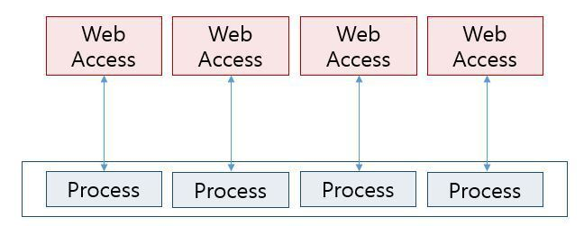
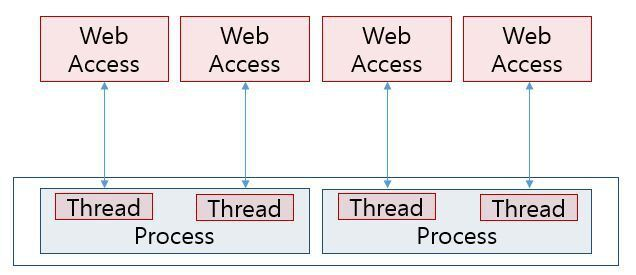
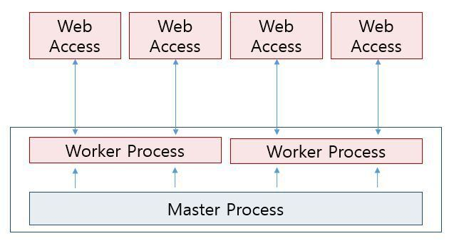

- [웹서버](#웹서버)
- [Nginx란?](#nginx란)
  - [Nginx의 특징](#nginx의-특징)
  - [Apache 살펴보기](#apache-살펴보기)
  - [이벤트 구독 방식(nginx)](#이벤트-구독-방식nginx)

 

## 웹서버

> 웹서버는 Http를 통해 `웹 클라이언트`가 요청한 데이터를 제공해주는 즉, 요청에 응답하는 프로그램  
> 개발자는 서버에 Apache나 Nginx같은 웹 서버 프로그램을 이용하여 사용자의 HTTP 요청에 응답하게 된다.

 

## Nginx란?

 

> Nginx는 경량 웹서버이다.
> 클라이언트로부터 요청을 받았을 때 요청에 맞는 정적 파일을 응답해주는 웹서버로 활용하기도 하고,  
> Reverse Proxy Server로 활용하여 로드밸런서, 캐시 처리, 암호화 기능을 처리할 수 도 있다.

 

### Nginx의 특징

> Nginx의 가장 큰 특징은 비동기(Event-Driven) 구조로 동작하여  
> 한 개 또는 고정된 프로세스만 생성하여 사용하도록 하고  
> 요청들을 Concurrency하게 처리할 수 있다.
>
> 그에 따라 동시 접속자 수가 늘어날 수록 자원이 증가하는  
> Apache 서버에 비해 Nginx는 적은 자원으로 효율적인 운용이 가능하여  
> 동시 처리수를 급격하게 늘릴 수 있다.

 

### Apache 살펴보기

 

> 아파치 서버는 사용자의 HTTP 요청이 올 때마다 프로세스나 스레드를 새로 만든다.  
> 이 경우 사용자 동시 접속이 늘어날 수록 프로세스마다 메모리를 할당함으로 메모리 사용량이 증가하고, 하나의 CPU가 여러 프로세스를 고속으로 번갈아 실행해야하므로  
> CPU부하가 높아지는 문제가 있다.

 

- prefork mpm 방식
  - http 요청이 올 때마다 프로세스를 매번 복제하여 프로세스에서 싱글 스레도로 해당 http 요청을 처리
  - 사용자 요청 수 = 프로세스 수
- worker mpm 방식(멀티 스레드)
  - 한 개의 프로세스가 여러 스레드를 생성하여 해당 http 요청을 처리하여 prefork보다는 메모리 소모가 적다.
  - 하지만 멀티스레딩 방식은 cpu 스케줄링을 위한 처리시간과 context switching 비용이 발생한다.

 

|                        방식                         |                          처리 주체                           |                               장점                                |                  단점                   |     대응 예     |
| :-------------------------------------------------: | :----------------------------------------------------------: | :---------------------------------------------------------------: | :-------------------------------------: | :-------------: |
|                 프로세스 기반 방식                  |                           프로세스                           |                    구조가 간단하고 구현이 쉽다                    |       대량의 메모리가 필요, 느림        | Apache(prefork) |
|                  스레드 구동 방식                   |                프로세스와 스레드의 하이브리드                |             메모리를 적게 사용, 설정에 따라 약간 빠름             | 이벤트 구동 방식보다 성능한계가 먼저 옴 | Apache(worker)  |
| 이벤트 구동 방식(마스터 프로세스가 클라이언트 대응) | 마스터 프로세스가 클라이언트 요청 수신, 워커 프로세스가 응답 |             마스터 프로세스 부분의 구현이 비교적 간단             |     마스터 프로세스가 병목이 된다.      |   lighthttpd    |
|  이벤트 구동 방식(워커 프로세스가 클라이언트 대응)  |         워커 프로세스가 클라이언트 요청 수신과 응답          | 메모리를 가장 적게 사용, CPU 코어를 최대로 사용하면 상당히 빠르다 |           구현이 매우 어려움            |      nginx      |

 

|               프로세스를 여러 개 생성하여 병렬 처리를 실현하는 멀티프로세스 모델                |
| :---------------------------------------------------------------------------------------------: |
|  |

 

|                 프로세스가 아니라 보다 경량의 실행 단위인 스레드를 사용하는 멀티 쓰레드 모델                 |
| :----------------------------------------------------------------------------------------------------------: |
|  |

 

> MPM으로 무엇을 이용할지는 아파치를 설치할 때 컴파일 타임에 결정되므로  
> 나중에 다른 MPM을 사용할 경우 기본적으로 아파치를 재컴파일해야한다.

 

- prefork와 worker 방식의 차이가 성능에 미치는 영향
  - prefork를 worker로 변경하더라도 하나의 클라이언트에 대한 응답시간이 고속화되는 것은 아니다.
  - prefork를 worker로 변경하더라도 메모리가 충분하다면 동시에 처리할 수 있는 접속 수는 변하지 않는다.
  - prefork를 worker로 변경하더라도 대량의 컨텍스트 스위치가 없다면(동시에 병렬적으로 대량의 액세스가 없다면) 효과는 크지 않다
  - prefork를 사용하더라도 카피온라이트로 인해 갱신되지 않은 메모리 공간은 공유되므로, 그렇게까지 현저한 차가 나는 것은 아니다.

 

- worker로 변경해서 효과적인 부분
  - 이용할 수 있는 메모리 용량이 크지 않은 경우, 메모리 소비량을 줄이고자 할 경우, 이 경우 프로세스보다 메모리 소비량이 적은 스레드의 이점이 살아난다.
  - 컨텍스트 스위치 획수가 많아서 그만큼의 CPU 리소스를 줄이고자 할 경우, 대량의 액세스로 인한 CPU 사용률을 줄이고자 할 경우 쓰레드의 context switch overhead가 낮으므로 CPU 소비가 줄어든다.

> 다만, 멀티스레드에서 메모리 공간 전체를 복수의 스레드가 공유하므로, 리소스 경합이 발생하지 않도록 주의해야 한다.  
> 멀티쓰레드 프로그래밍이 복잡한 이유...

 

### 이벤트 구독 방식(nginx)

 

> Nginx는 요청에 응답하기 위해 비동기 이벤트 기반 구조를 가진다.  
> 정해진 수의 프로세스가 이 요청들을 이벤트로 등록하고  
> 비동기 방식으로 대기시켜 완료되는 요청부터 응답처리해주는 것을 의미

 

|                 각 워커 프로세스에서 이벤트를 받아들이고 이벤트를 처리하는 방식                  |
| :----------------------------------------------------------------------------------------------: |
|  |

 

- master process
  - 특권 명령 수행하고 single thread로 구성된 다수의 worker process 관리
  - listen socket에 port 바인딩
  - nginx 설정 읽기
  - 아래 3가지 타입의 자식 프로세스 생성하고 관리
- child processes
  - cache loader
    - 디스크 기반 캐시를 메모리에 불러오고 종료
    - nginx 시작시 실행
    - 보수적으로 스케줄링 되어, 이프로세스의 리소스 요구사항이 낮다.
  - cache manager
    - 주기적으로 실행
    - 디스크 캐시 설정된 사이즈로 유지하기 위해 캐시 엔트리 정리
  - worker process(single thread)
    - listen 소켓 배정
    - listen 소켓으로부터 클라이언트의 요청이 들어오면 커넥션 형성하여 처리
    - 초당 수천 개의 모든 http 요청을 한 프로세스에서 처리하고 응답
    - cpu 코어당 1개의 worker 프로세스를 생성하도록 설정하는 것을 권장
    - 각 worker 프로세스들은 문맥 전환을 줄이기 위해 non-blocking 방식으로 동작

 

- nginx 도입시 장점
  - worker 프로세스 싱글 스레드를 채택하여 context switch overhead가 발생하지 않는다.
  - 비동기 처리로 인해 적은 메모리 사용량을 동시성을 보장한다.
  - nginx는 웹서버 기능 이외에도 로드밸런스와 같은 캐시 기능도 있다.

 

> 즉 nginx는 싱글 프로세스 스레드로 이벤트 구동에 의한 non-blocking 처리를 하므로 처리 속도가 매우 빠르다.  
> 하지만 non-blocking 처리에 따라 프로그램의 제어가 이벤트 핸들러로 넘어왔다고는 하나 `실제 데이터를 읽고 쓰는건 커널 내에 있는 시스템 호출 프로그램과 하드웨어 사이에서 실행`되므로, 해당 처리가 너무 길어지면(I/O 시간이 길어지면) 결국 시스템 호출 큐에 요청이 많이 쌓여 성능이 저하된다.

 

> 따라서 nginx는 매우 작은 데이터를 대량으로 전송하는 서버나,  
> 하드디스크 읽기와 쓰기가 발생하지 않는 In-memory Cache Server/ Reverse Proxy Server/ Front-end Load Balancer와 같은 역할에 적합하다.  
> 반대로 매우 복잡한 cgi 처리, 동영상 데이터 전성 데이터베이스 처리를 실행하는데는 적합하지 않다.

 

 
