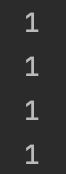

```java
@MappedSuperclass
@EntityListeners(AuditingEntityListener.class)
@Getter
@EqualsAndHashCode
public class BaseEntity {

	@Id
	@GeneratedValue(strategy = AUTO)
	private Long id;
}
```

> 현재 저희 BaseEntity에는 Id 생성전략이 AUTO로 JPA가 id 생성을 위임받아 사용하고 있습니다.

</br>

```java
@DisplayName("가계부(AccountBook) 조회 레포지토리 테스트")
class AccountBookQueryRepositoryTest extends RepositoryTest {

	@Autowired
	private AccountBookQueryRepository accountBookQueryRepository;

	private User user;

	private Category category;

	private UserCategory userCategory;

	private Expenditure expenditure;

	@BeforeEach
	void setup() {
		user = save(createUser());
		category = save(createCategory());
		userCategory = save(new UserCategory(user, category));
		expenditure = save(createExpenditure(userCategory));
	}

	@Test
	public void test() {
		Optional<Expenditure> empty = accountBookQueryRepository.findById(0L);
		Optional<Expenditure> present = accountBookQueryRepository.findById(expenditure.getId());

		System.out.println(user.getId());
		System.out.println(category.getId());
		System.out.println(userCategory.getId());
		System.out.println(expenditure.getId());

		assertThat(empty).isEmpty();
		assertThat(present).isNotEmpty();
	}
}
```

> 현재 제가 querydsl 사용하기 위해 설정 걸어놓고 테스트하던 도중 이상한 점을 발견하였습니다.

- 각 테이블
  - user
  - category
  - userCategory
  - expenditure

> 가 있고, 이것이 각각 한 개씩 저장되었다면(DB에 데이터 없는 상태)
> 네 개의 id는 모두 1이어야 한다고 생각했습니다.

|             AUTO             |
| :--------------------------: |
|  |

</br>

> 그런데 이렇게 id generator를 공유해서 사용하는 것처럼 보입니다.  
> 처음에는 baseEntity를 사용해서 그런건가 했는데, expenditure에 BaseEntity를 제거하고  
> 필드로 id를 넣어도 똑같은 결과를 보였습니다.

</br>

|               IDENTITY               |
| :----------------------------------: |
|  |

</br>

- GENERATIONTYPE.AUTO를 사용하면 안되는 이유!
  - mysql에서 GENERATION.AUTO를 볼 경우 identity가 아니라 table 전략을 실행
  - table 전략을 사용하면 모든 테이블의 id를 한 테이블에서 id가 관리

> AUTO 전략을 오해하지 말자.  
> 각 벤더사마다 AUTO에 대한 전략을 어떻게 할지는 다르다.  
> 결론: MYSQL은 AUTO로 설정하면 TABLE 전략을 쓴다.

</br>

- [reference](https://pomo0703.tistory.com/203)
