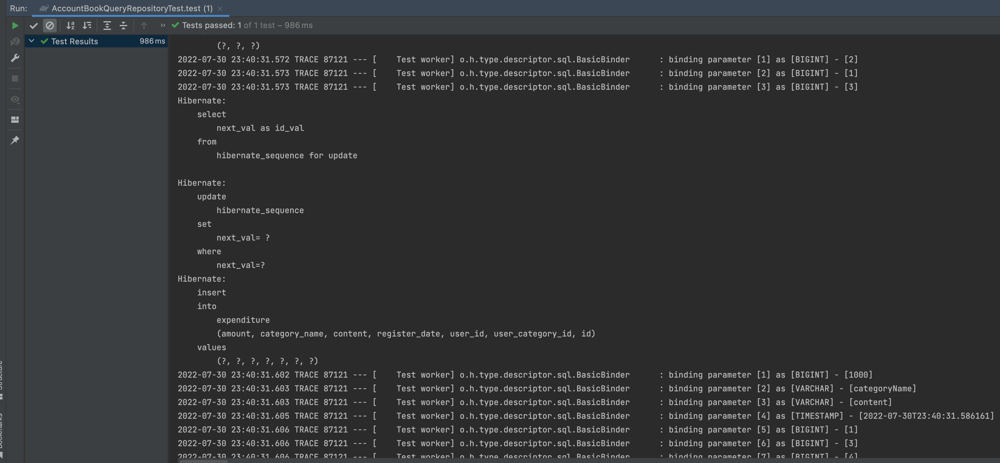

</br>

> 유석님과 같은 주변 분들의 혹시나의 삽질을 막기 위해  
> 글 하나 만들었습니당.

</br>

```java
@Configuration
public class QueryDslConfig {

	@PersistenceContext
	private EntityManager entityManager;

	@Bean
	public JPAQueryFactory jpaQueryFactory() {
		return new JPAQueryFactory(entityManager);
	}
}

```

```java
@Repository
@RequiredArgsConstructor
public class AccountBookQueryRepository {

	private final JPAQueryFactory queryFactory;

	public Optional<Expenditure> findById(Long expenditureId) {
		return Optional.ofNullable(
			queryFactory.select(expenditure)
				.from(expenditure)
				.where(expenditure.id.eq(expenditureId))
				.fetchOne()
		);
	}
}
```

</br>

> 우선 이번 프로젝트에서 가계부 조회 쿼리를 만들일이 많이 생겼습니다.  
> 근데 수입과 지출에 대한 도메인에 맞춰서 조회를 하는 것보다  
> `화면에 맞춰서 쿼리가 작성될 일이 많다고 판단했어요.`
> jpql로 짜서 entity들을 service로 가져와서 데이터를 조합해서 응답을 보내주어도 해결 가능할 것같지만  
> 나중에 분류, 내용에 대한 통계, 그리고 날짜를 다뤄야하는 작업들 때문에
> `컴파일 타임에서 쿼리의 문제를 잡아주고 동적 쿼리에 대한 장점이 있는 querydsl을 사용하는게 좋다고 판단했습니다.`

</br>

- [원래는 이렇게 하는 것이 좋다](https://github.com/jki503/QueryDSL/blob/main/doc/section06.md)

</br>

> 더 쓰기에는 시간이 없어서 링크를 첨부합니다.  
> 사실은 jpaRepository를 사용할 부분에 custom 인터페이스를 만들고  
> 그 custom 인터페이스를 직접 구현하는 것이 좋은 방법이다.

- 코드 응집도가 높아진다.
- jpa가 아닌 또다른 클래스를 만드는 것이 추후 큰 사이즈의 프로젝트일 경우 관리 불편
- 지금같이 작은 프로젝트에서는 괜찮지만...
  - 작은프로젝트의 문제는... 팀원들이 queryDsl을 모르면 좀 그럴 수도...

</br>

- 테스트 확인 해보기

```java
@TestConfiguration
public class TestConfig {

	@PersistenceContext
	private EntityManager entityManager;

	@Bean
	public JPAQueryFactory jpaQueryFactory() {
		return new JPAQueryFactory(entityManager);
	}

	// @Bean
	// public AccountBookQueryRepository accountBookQueryRepository(JPAQueryFactory jpaQueryFactory) {
	// 	return new AccountBookQueryRepository(jpaQueryFactory);
	// }
}

```

```java
package com.prgrms.tenwonmoa.domain.accountbook.repository;

import static com.prgrms.tenwonmoa.common.fixture.Fixture.*;
import static org.assertj.core.api.Assertions.*;

import java.util.Optional;

import org.junit.jupiter.api.BeforeEach;
import org.junit.jupiter.api.DisplayName;
import org.junit.jupiter.api.Test;
import org.springframework.beans.factory.annotation.Autowired;

import com.prgrms.tenwonmoa.common.RepositoryTest;
import com.prgrms.tenwonmoa.domain.accountbook.Expenditure;
import com.prgrms.tenwonmoa.domain.category.Category;
import com.prgrms.tenwonmoa.domain.category.UserCategory;
import com.prgrms.tenwonmoa.domain.user.User;

@DisplayName("가계부(AccountBook) 조회 레포지토리 테스트")
class AccountBookQueryRepositoryTest extends RepositoryTest {

	@Autowired
	private AccountBookQueryRepository accountBookQueryRepository;

	private User user;

	private Category category;

	private UserCategory userCategory;

	private Expenditure expenditure;

	@BeforeEach
	void setup() {
		user = save(createUser());
		category = save(createCategory());
		userCategory = save(new UserCategory(user, category));
		expenditure = save(createExpenditure(userCategory));
	}

	@Test
	public void test() {
		Optional<Expenditure> empty = accountBookQueryRepository.findById(0L);
		Optional<Expenditure> present = accountBookQueryRepository.findById(expenditure.getId());

		assertThat(empty).isEmpty();
		assertThat(present).isNotEmpty();
	}
}

```

> RepositoryTest를 상속받고 있는 Test Class입니다.(@DataJpaTest가 여기 존재)  
> QueryDsl을 사용할 경우 @DataJpaTest가 querydsl 빈을 찾아오지못해서  
> TestConfig에서 빈등록을 해주고 @Import(TestConfig.class)를 테스트 클래스에 붙여서 사용한다.(이것도 RepositoryTest에 존재)

</br>

> 위 코드와 같이 빈 설정 해주고  
> 코드 작성을 마치고 빌드와 테스트 문제가 없는지 확인하려던 찰나에

</br>

```text
Error creating bean with name 'com.prgrms.tenwonmoa.domain.accountbook.repository.AccountBookQueryRepositoryTest': Unsatisfied dependency expressed through field 'accountBookQueryRepository'; nested exception is org.springframework.beans.factory.NoSuchBeanDefinitionException: No qualifying bean of type 'com.prgrms.tenwonmoa.domain.accountbook.repository.AccountBookQueryRepository' available: expected at least 1 bean which qualifies as autowire candidate. Dependency annotations: {@org.springframework.beans.factory.annotation.Autowired(required=true)}

```

> 빈을 찾아올 수 없다고 예외가 터진다...  
> 삽질을 2시간 가까이 한 후에!
> @DataJpaTest는 Jpa 관련 설정 파일만 불러오는 어노테이션이라는 것을 알고도 모르는 멍청한 짓을 했습니다.

</br>

```java
@TestConfiguration
public class TestConfig {

	@PersistenceContext
	private EntityManager entityManager;

	@Bean
	public JPAQueryFactory jpaQueryFactory() {
		return new JPAQueryFactory(entityManager);
	}

	@Bean
	public AccountBookQueryRepository accountBookQueryRepository(JPAQueryFactory jpaQueryFactory) {
		return new AccountBookQueryRepository(jpaQueryFactory);
	}
}

```

</br>

> 그래서 TestConfig 파일에 빈등록을 하였습니다.
> @Import(AccountBookQueryRepository)를 붙여서 사용해도 되지만  
> @Import 어노테이션의 올바른 가이드에서 벗어나서 사용하는 것같아 찝찝했습니다...

</br>

|               QueryDsl               |
| :----------------------------------: |
|  |

</br>

> 무사히 테스트를 통과했습니다.

- 문제점
  - 구글링에 의존하려고 했다.
  - 남의 의견만을 듣지 말고 내가 천천히 다시 고민해보기.
