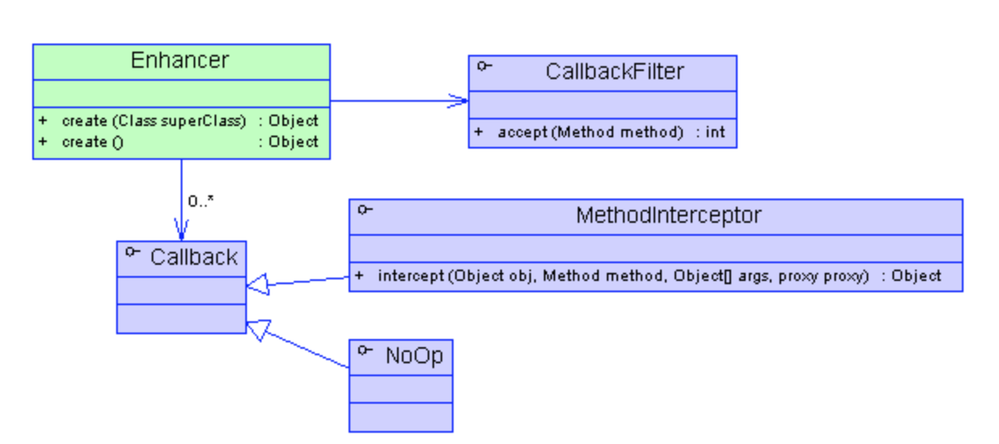
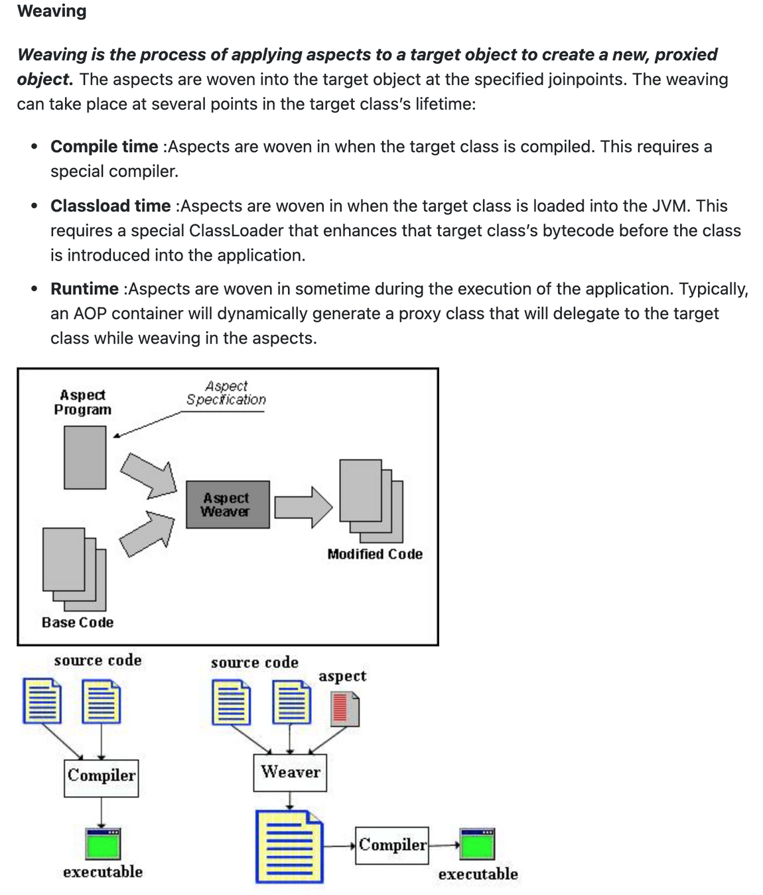

</br>

- [AOP가 무엇인가?](#aop가-무엇인가)
- [스프링에서 채택한 AOP 방법 : proxy](#스프링에서-채택한-aop-방법--proxy)
  - [Proxy란?](#proxy란)
  - [다이나믹 프록시를 구현하기 위한 방법 2가지](#다이나믹-프록시를-구현하기-위한-방법-2가지)
  - [용어](#용어)
  - [Weaving](#weaving)

</br>

> 나는 aop를 주로  
> api 요청에 대한 ip, method, uri, parmeter, body, time를 `LoggingAspect`로  
> API 호출의 경과시간에 대한 `PerformanceAspect`를 작성한 후 사용하였다.
>
> 더 좋은 레퍼를 참고하고, 그것을 매프로젝트마다 반복해서 사용하다보니  
> 누군가에게 설명해줄 정도로 잘 알고 쓰는 것은 아닌 것같아서 한 번 정리해보고자 한다!

</br>

## AOP가 무엇인가?

</br>

- Aspect Oriented Programming의 약자로, 관점 지향 프로그래밍이라는 의미
- OOP의 약점을 보완하기 위해, 프로그래밍 할 수 있는 패러다임.

</br>

> (개인적인 생각)

</br>

## 스프링에서 채택한 AOP 방법 : proxy

</br>

> 디자인 패턴에서 말하는 프록시 패턴은 target 객체의 기능을 수행하기 위해  
> proxy 객체를 통해 client가 target에 접근하는 방식을  
> 변경하고 return 값에 대해 수정하지 않는 패턴이다.

</br>

### Proxy란?

</br>

> 일반적으로 `Proxy`는 실제 target의 기능을 대신 수행하면서, 기능을 확장하거나 추가하는 실제 객체를 의미합니다  
> `Proxy Pattern`은 target의 대한 기능을 확장하지 않고, Client가 Target에 접근하는 방식을 변경해줍니다.
> 이러한 점에서 오히려 `Proxy`는 <U>Template Method Pattern</U>과 비슷하다는 말도 있습니다.

- JdbcTemplate과 유사하기 try-catch-finally로 예외 처리하는 로직도 추가
- callback 메서드를 비즈니스 로직의 전 후로 <U>횡단 관심사</U>를 수행할 수 있기 때문

</br>

### 다이나믹 프록시를 구현하기 위한 방법 2가지

</br>

- JDK Dynamic Proxy : interface based
  - target 클래스가 구현하고 있는 interface를 구현하여 횡당 관심사 추가
  - 자바의 `Reflection(Runtime)`을 활용하여 Proxy를 동적으로 구현하기 때문에 리소스 부담이 높고 성능이 떨어진다.
    - reflection : 런타임에 실행해야하는 클래스를 알게 되어 그 클래스의 메서드, 타입, 변수들에 접근하게 해주는 JAVA API

</br>

- ReflectionPerson.java

```java
public class ReflectionPerson {

	private String name;
	private Integer age;
	private String address;

	public ReflectionPerson(String name, Integer age, String address) {
		this.name = name;
		this.age = age;
		this.address = address;
	}

	public ReflectionPerson() {};

	public void setAddress(String address) {
		this.address = address;
	}

	public String getName() {
		return name;
	}

	public Integer getAge() {
		return age;
	}

	public String getAddress() {
		return address;
	}
}
```

</br>

- Reflection test

</br>

```java
import static org.assertj.core.api.Assertions.*;

import java.lang.reflect.Constructor;
import java.lang.reflect.InvocationTargetException;
import java.lang.reflect.Method;
import java.util.Arrays;

import org.junit.jupiter.api.DisplayName;
import org.junit.jupiter.api.Test;
import org.slf4j.Logger;
import org.slf4j.LoggerFactory;

class ReflectionPersonTest {

	private Logger log = LoggerFactory.getLogger(getClass());

	@Test
	@DisplayName("동적으로 ReflectionPerson 인스턴스 만들기")
	void getInstanceDynamically() {
		try {
			Class<?> clazz = ReflectionPerson.class;
			assertThat(clazz).isEqualTo(ReflectionPerson.class);

			Constructor[] cons = clazz.getDeclaredConstructors();
			log.info("constructors : {}" , Arrays.toString(cons));

			Constructor<?> con = clazz.getDeclaredConstructor(String.class, Integer.class);
			log.info("declaredcon : {}", con);

			Object obj = con.newInstance();
			assertThat(obj).isInstanceOf(ReflectionPerson.class);

		} catch (NoSuchMethodException | InstantiationException | IllegalAccessException | InvocationTargetException e) {
			e.printStackTrace();
		}
	}

	@Test
	@DisplayName("동적으로 method 실행하기")
	void invokeMethodDynamically() {
		try {
			final String address = "Songpa";

			Class<?> clazz = ReflectionPerson.class;
			Object obj = clazz.getDeclaredConstructor().newInstance();

			Method[] methods = clazz.getMethods();
			Arrays.stream(methods).forEach(
				m-> log.info("methodName : {}", m.getName())
			);

			Method setMethod = Arrays.stream(methods)
				.filter(m-> m.getName().startsWith("set"))
				.findAny().get();

			setMethod.invoke(obj, address);   //invoke 시에 인스턴스가 필요하다.

			Method getAddressMethod = Arrays.stream(methods)
				.filter(m->m.getName().equals("getAddress"))
				.findAny().get();

			String invokedAddress = String.valueOf(getAddressMethod.invoke(obj));


		} catch (NoSuchMethodException | InstantiationException | IllegalAccessException | InvocationTargetException e) {
			e.printStackTrace();
		}

	}


public class TargetLogic implements Logic{

	@Override
	public String doSomething() {
		return "Do Target Logic in implemented instance";
	}

	@Override
	public String doNothing() {
		return "Do Nothing";
	}
}
```

- Logic

```java
public interface Logic {
	String doSomething();
	String doNothing();
}
```

- target이 되는(비즈니스 로직을 갖고있는) 구현 클래스

```java
public class TargetLogic implements Logic{

	@Override
	public String doSomething() {
		return "Do Target Logic in implemented instance";
	}

	@Override
	public String doNothing() {
		return "Do Nothing";
	}
}
```

- 프록시가(횡단 관심사를 추가하는) 될 구현 클래스

</br>

```java
@Slf4j
public class ProxyLogic implements Logic {

    Logic targetLogic;

    ProxyLogic(Logic targetLogic) {
        this.targetLogic = targetLogic;
    }

    @Override
    public String doSomething() {
        log.info("Proxy Instance :: doSomething");
        return targetLogic.doSomething();
    }

    @Override
    public String doNothing() {
        return targetLogic.doNothing();
    }
}
```

- 실제 프록시 패턴에서 이런식으로 구현하여 target 객체의 기능 전에 log를 찍는 기능을 추가하여 구현한다.
- 하지만 개발자가 횡단 관심사를 추가한 proxy 클래스를 매번 작성할 수는 없고, 그래서 refelction으로 proxy를 만든다고 하여 dynamic proxy라고 한다

</br>

- 실제 프록시 만든 것 테스트

</br>

```java

import static org.hamcrest.MatcherAssert.*;
import static org.hamcrest.Matchers.*;

import org.junit.jupiter.api.DisplayName;
import org.junit.jupiter.api.Test;

public class InterfacedBasedProxyTest {

	private final static String DO_SOMETHING="Do Target Logic in implemented instance";
	private final static String DO_NOTHING="Do Nothing";


	@Test
	@DisplayName("순수 자바 코드로 Proxy를 만들 수 있다.")
	void testProxy() {
		ProxyLogic proxiedLogic = new ProxyLogic(new TargetLogic());

		assertThat(proxiedLogic.doSomething(), is(DO_SOMETHING));
		assertThat(proxiedLogic.doNothing(), is(DO_NOTHING));
	}
}

```

</br>

- CGLIB Proxy : subclass based
  - Target 클래스를 상속하는 proxy 클래스에서 횡단 관심사를 추가하는 방법
  - <U>바이트 코드 조작을 통해 동적으로 proxy 인스턴스 생성</U>한다.
  - 상속을 이용하기 때문에 클래스나 메서드에 final이 붙어있으면 구현이 안된다.
  - SpringBoot에서 AOP 사용을 위해 채택한 방법
  - Hibernate, Mockito에서도 cglib를 채택하여 사용한다.

</br>

|             CGLib Proxy 예시              |
| :---------------------------------------: |
|  |

</br>

- [SpringBoot가 CGLib를 채택한 이유](https://gmoon92.github.io/spring/aop/2019/04/20/jdk-dynamic-proxy-and-cglib.html)
- [바이트 코드 조작](https://taes-k.github.io/2021/04/25/byte-code-instrumentation/)

### 용어

- Advice

  - 횡단 관심사 로직 메서드 위에 어드바이스가 실행되는 타이밍(Before, AfterRunning, AfterThrowing, After, Around)를 어노테이션으로 작성한다.

  - @Before : 의도한 클래스 및 메서드의 실행 전
  - @After : 의도한 클래스 및 메서드의 실행 후
  - @Around : 의도한 클래스 및 메서드의 실행 전, 후

```java
// Logic 으로 끝나는 클래스의 Something으로 끝나는 메소드 실행 전
@Before("execution(public * com.java.spring.aop..*Logic.*Something())")
public void logBefore(JoinPoint joinPoint) {
    log.info("before {} :: {}", joinPoint.getTarget().getClass().getCanonicalName(), joinPoint.getSignature().getName());
}

// Logic 으로 끝나는 클래스의 do로 시작하는 메소드 실행 후
@After("execution(public * com.java.spring.aop..*Logic.do*())")
public void logAfter(JoinPoint joinPoint) {
    log.info("after {} :: {}", joinPoint.getTarget().getClass().getCanonicalName(), joinPoint.getSignature().getName());
}

// 모든 클래스의 모든 메소드 실행 전 후
@Around("execution(public * com.java.spring.aop..*.*())")
public Object logAround(ProceedingJoinPoint joinPoint) throws Throwable {
    log.info("around Before {} :: {}", joinPoint.getTarget().getClass().getCanonicalName(), joinPoint.getSignature().getName());
    var result = joinPoint.proceed();
    log.info("around After result =>  {} ", result);
    return result;
}
```

</br>

- pointCut : Advice가 끼어들어가는 로직

</br>

```java
// 포인트 컷 클래스 사용
@Around("com.java.spring.aop.aspectj.CommonPointCut.loggingBeforeMethod()")

public class CommonPointCut {
    @Pointcut("execution(public * com.java.spring.aop..*Logic.*Something())")
    public void loggingAroundMethod() {}
}

// 어노테이션 사용
@After("@annotation(Logging)")

public @interface Logging {
}
```

</br>

- JoinPoint
  - 포인트 컷에 의해 실제로 실행되는 메서드
  - Advice가 선언된 메서드에 argument로 받을 수 있다
  - JoinPoint 객체로 그 메서드의 이름, 파라미터 타입, 클래스 타입 등등을 알 수 있습니다.

</br>

### Weaving

</br>

|                  Runtime weaving                   |
| :------------------------------------------------: |
|  |

</br>

> Spring에서는 Proxy를 이용하여 <U>런타임 위빙</U>을 통해서 관심사를 추출합니다.

</br>

- Runtime Weaving이란?

> `위빙은 target 객체를 새로운 proxied 객체로 적용`시키는 과정.  
> 따라서 `runtime weaving은 런타임시에 이러한 위빙이 진행되는 방식!`
> 위의 어노테이션들을 사용하는 이유는 Weaving이 가능하도록 직관적으로 설정하기 위함입니다.
